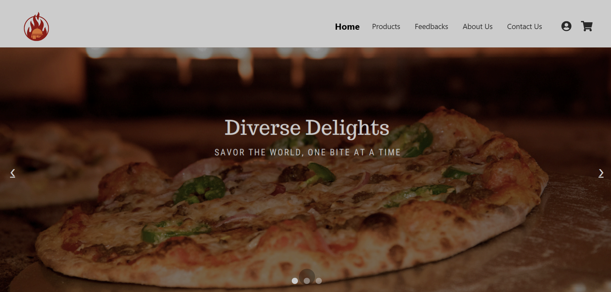
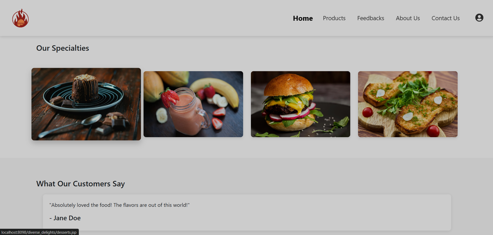
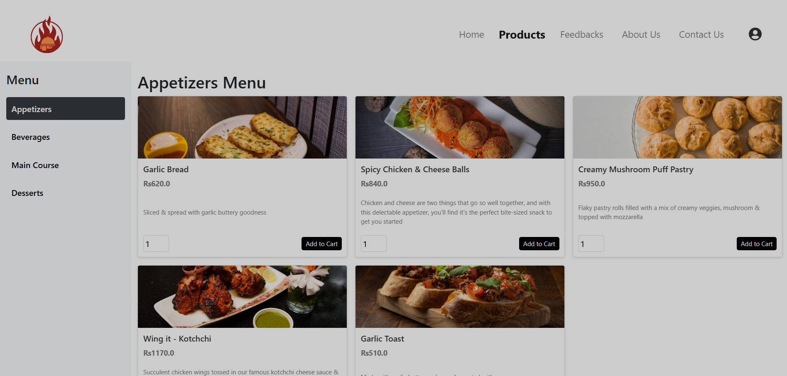
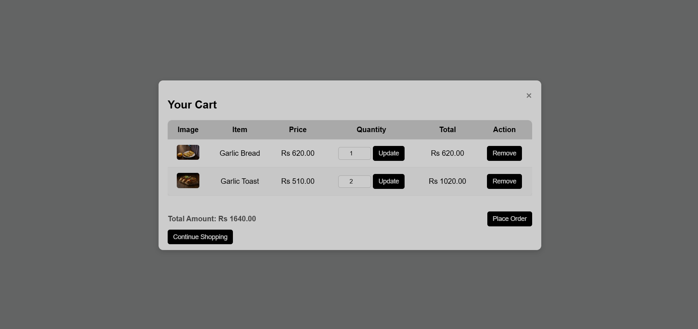
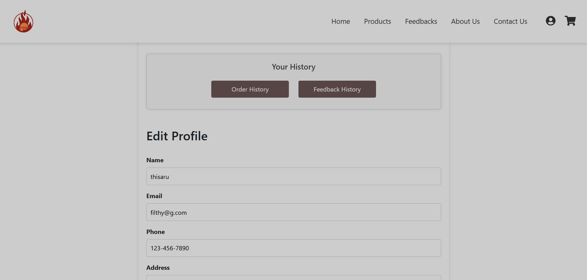
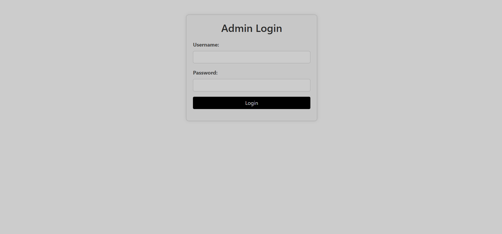
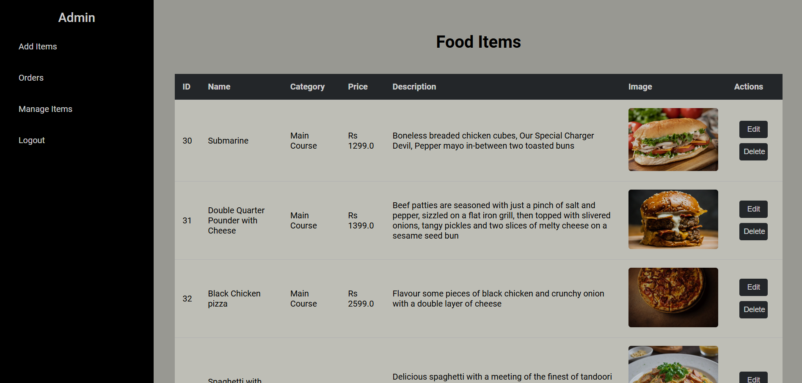

  
  <h1 align="center">Diverse Delights</h1>

 
<h2 align="center">About the project</h2>
Diverse Delights is an <b>Online Food Ordering System</b> that allows users to browse a variety of food items and place orders.
To place an order, users must log in to the system (unregistered users can create an account). Restaurants can manage orders and deliveries through the admin panel. 

## Built With

This project was built with the following major technologies:

* [![Java][Java-logo]][Java-url] 
* [![Apache Tomcat][Apache-Tomcat-logo]][Apache-Tomcat-url] 
* [![MySQL Workbench][Workbench-logo]][Workbench-url] 
* [![CSS][CSS-logo]][CSS-url] 
* [![JavaScript][JavaScript-logo]][JavaScript-url] 
* [![Bootstrap][Bootstrap-logo]][Bootstrap-url] 

[Java-logo]: https://img.shields.io/badge/Java-007396?style=flat&logo=java&logoColor=white
[Java-url]: https://www.java.com
[Apache-Tomcat-logo]: https://img.shields.io/badge/Apache%20Tomcat-FF7A00?style=flat&logo=apachetomcat&logoColor=white
[Apache-Tomcat-url]: https://tomcat.apache.org/
[Workbench-logo]: https://img.shields.io/badge/MySQL%20Workbench-00618A?style=flat&logo=mysql&logoColor=white
[Workbench-url]: https://www.mysql.com/products/workbench/
[CSS-logo]: https://img.shields.io/badge/CSS-1572B6?style=flat&logo=css3&logoColor=white
[CSS-url]: https://developer.mozilla.org/en-US/docs/Web/CSS
[JavaScript-logo]: https://img.shields.io/badge/JavaScript-F7DF1E?style=flat&logo=javascript&logoColor=black
[JavaScript-url]: https://developer.mozilla.org/en-US/docs/Web/JavaScript
[Bootstrap-logo]: https://img.shields.io/badge/Bootstrap-7952B3?style=flat&logo=bootstrap&logoColor=white
[Bootstrap-url]: https://getbootstrap.com/

## Screenshots
#### Home Page

  
  

#### Products Page

#### Cart

#### Profile

#### Admin

  
  

